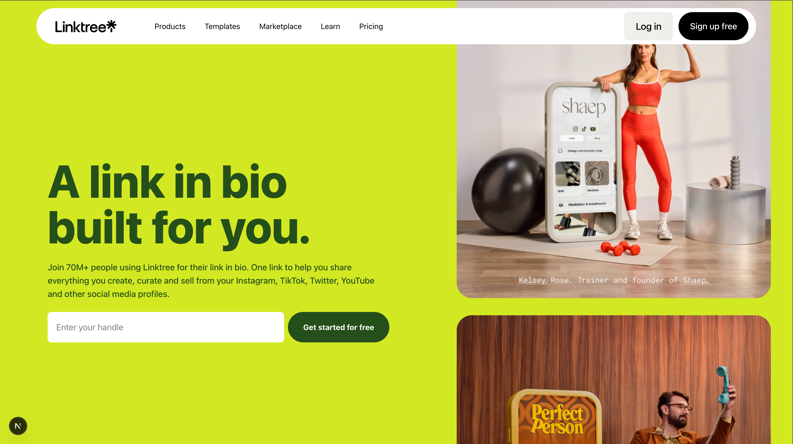
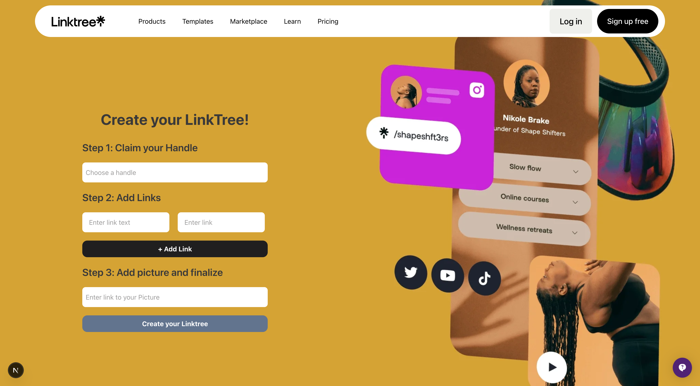
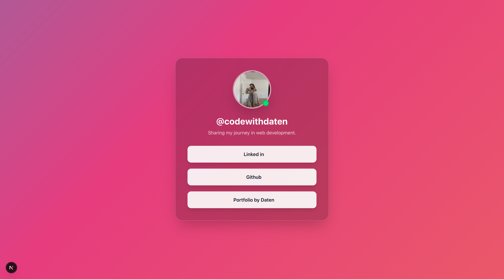

<h1 align="center">
  
</h1>

<p align="center">
  
  
  
  
</p>

---

<h2 align="center">🌟 About the Project</h2>

<p align="center">
  <b>Linktree Clone</b> — A futuristic, vibrant, and interactive web app for creating your personal link-in-bio hub.  
  Designed for creators, developers, and dreamers who want their online presence to look <i>as dynamic as their ideas</i>.
</p>

<p align="center">
  ⚡ Built using <b>Next.js + TailwindCSS</b><br/>
  🎨 Styled with <b>modern gradients & motion</b><br/>
  🚀 Deployed with <b>Vercel</b>
</p>

---

<h2 align="center">✨ Features</h2>

| Feature               | Description                                             |
| --------------------- | ------------------------------------------------------- |
| 🧠 Custom Handle      | Claim your unique handle and personalize your link hub. |
| 🌈 Vibrant UI         | Eye-catching, minimalistic, and futuristic design.      |
| ⚡ Instant Editing    | Add, edit, and remove links dynamically.                |
| 🖼️ Profile Picture    | Add your avatar or image.                               |
| 💫 Fully Responsive   | Optimized for all screen sizes.                         |
| 🚀 Deployed on Vercel | Fast, free, and reliable hosting.                       |

---

<h2 align="center">🛠️ Tech Stack</h2>

| Framework  | Styling      | Hosting | Tools                           |
| ---------- | ------------ | ------- | ------------------------------- |
| Next.js 15 | Tailwind CSS | Vercel  | React Icons, Framer Motion, Git |

---

<h2 align="center">⚙️ Setup & Installation</h2>

# 1️⃣ Clone this repository

```
git clone https://github.com/Shazia-Zameer-999/Linktree
```

# 2️⃣ Move into the folder

```
cd Linktree
```

# 3️⃣ Install dependencies

```
npm install
```

# 4️⃣ Run locally

```
npm run dev
```

<h2 align="center">💫 Preview</h2>
<p align="center">
  
  
  
</p>
<h2 align="center">🪄 Connect With Me</h2>
<h3 align="center">💎 Share My Portfolio</h3>
<p align="center"><a href="https://portfolio-dd-ebon.vercel.app/">Daten</a></p>

<h3 align="center">✨ “Where creativity meets clean code.” ✨</h3>
