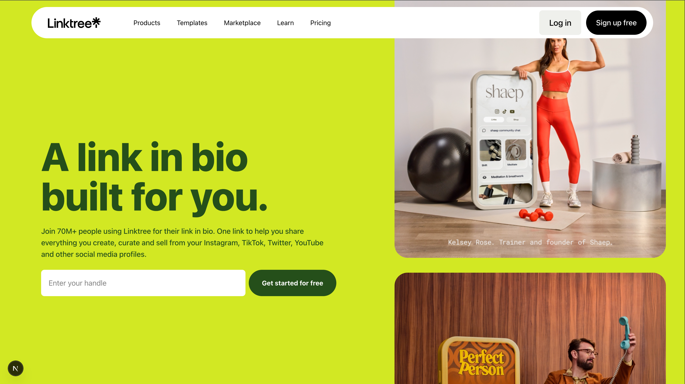
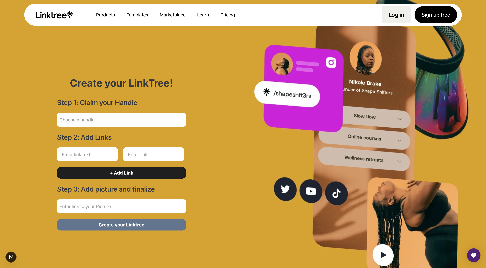
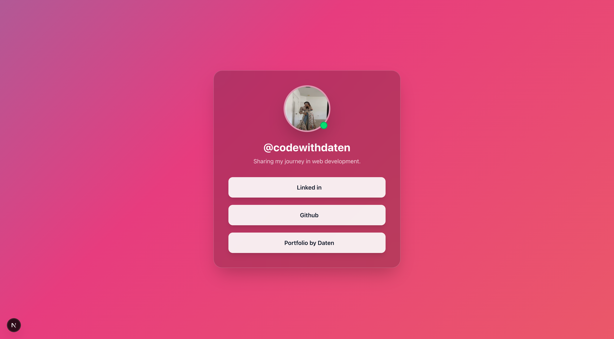
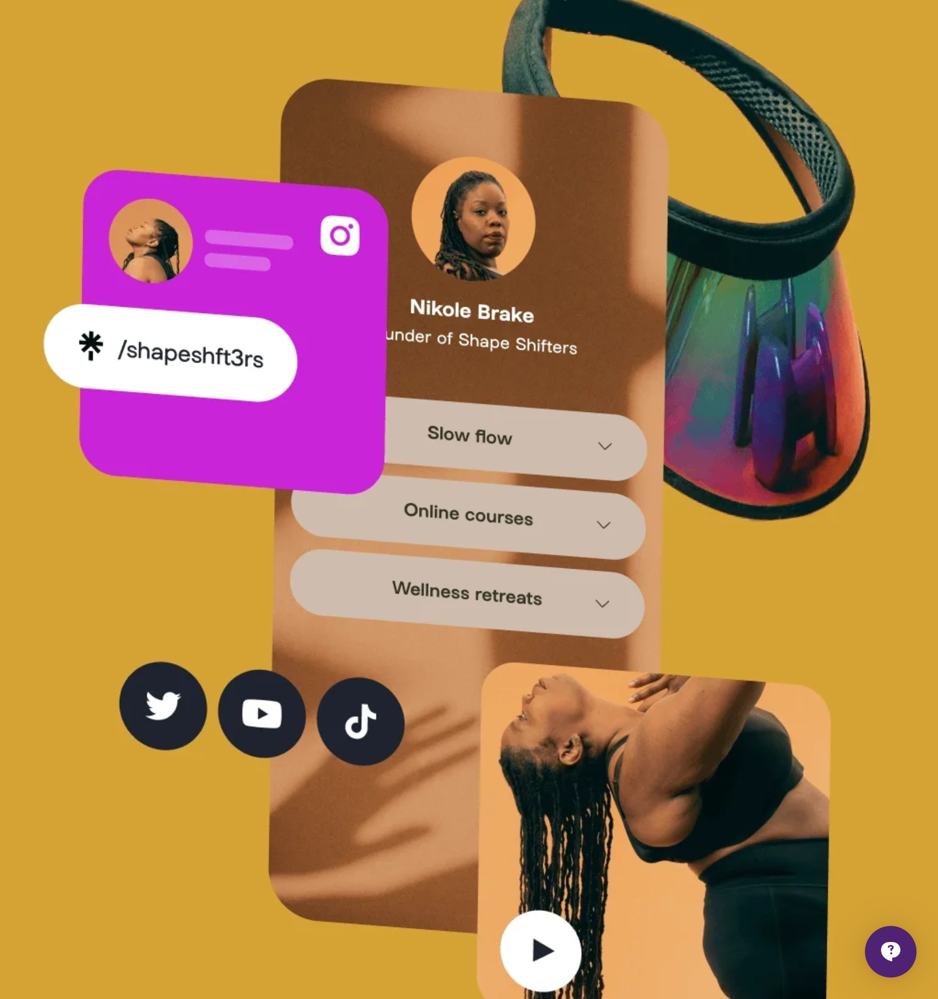
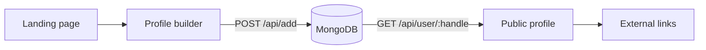

<div align="center">
  

  # Linktree Clone

  **A full-stack link-in-bio builder for creating and sharing one polished profile page.**

  [](https://nextjs.org/)
  [](https://react.dev/)
  [](https://tailwindcss.com/)
  [](https://www.mongodb.com/)
  [](https://github.com/Shazia-Zameer-999/Linktree/actions/workflows/ci.yml)
  [](https://github.com/Shazia-Zameer-999/Linktree/stargazers)
  [](https://github.com/Shazia-Zameer-999/Linktree/issues)

  [Features](#-features) · [Quick start](#-quick-start) · [How it works](#-how-it-works) · [API](#-api-reference)
</div>

---

## Overview

This project recreates the core Linktree experience as a modern full-stack application. Visitors can claim a unique handle, add their links and bio, upload or link a profile image, and publish a responsive public page at `/{handle}`.

It is more than a static UI clone: profile data is persisted in MongoDB and served through Next.js Route Handlers.

## ✨ Features

- **Unique public profiles** — every creator receives a shareable `/{handle}` page.
- **Dynamic link builder** — add as many labeled links as needed before publishing.
- **Flexible profile images** — use a remote image URL or upload a local image up to 2 MB.
- **MongoDB persistence** — profiles and links survive beyond the browser session.
- **Handle validation** — prevents duplicate handles and supports letters, numbers, `_`, and `-`.
- **Safer public links** — server validation accepts only normalized HTTP and HTTPS destinations.
- **Animated landing page** — GSAP marquees and Typed.js text effects create a lively experience.
- **Responsive navigation** — adaptive mobile menu, active-section tracking, and scroll-aware behavior.
- **Accessible interactions** — labeled navigation, keyboard dismissal, expanded states, and feedback toasts.
- **Responsive design** — the landing page, builder, and public profile work across screen sizes.

## 📸 Preview

<p align="center">
  
  
</p>
<p align="center">
  
  
</p>

## 🧰 Tech stack

| Layer | Technology | Purpose |
| --- | --- | --- |
| Framework | Next.js 15 App Router | UI, routing, server endpoints, and production builds |
| Frontend | React 19 | Interactive components and client-side state |
| Styling | Tailwind CSS 4 | Responsive, utility-first design |
| Database | MongoDB | Profile and link persistence |
| Animation | GSAP + Typed.js | Marquees, transitions, and typing effects |
| UI utilities | React Icons + React Toastify | Icons and user feedback |
| Quality | ESLint 9 | Static code analysis |

## 🚀 Quick start

### Prerequisites

- [Node.js](https://nodejs.org/) 20 or newer
- npm
- A [MongoDB Atlas](https://www.mongodb.com/atlas) cluster or local MongoDB instance

### Installation

```bash
git clone https://github.com/Shazia-Zameer-999/Linktree.git
cd Linktree
npm install
```

Create `.env.local` in the project root:

```env
MONGODB_URI=mongodb+srv://<username>:<password>@<cluster>/<database>
NEXT_PUBLIC_SITE_URL=http://localhost:3000
```

Start the development server:

```bash
npm run dev
```

Open [http://localhost:3000](http://localhost:3000), choose a handle, and build your page.

> [!IMPORTANT]
> Never commit `.env.local` or expose your MongoDB connection string. Add the same variable to your hosting provider's environment settings when deploying.

## 🧭 How it works


```mermaid
flowchart LR
    A[Landing page] --> B[Profile builder]
    B -->|POST /api/add| C[(MongoDB)]
    C -->|GET /api/user/:handle| D[Public profile]
    D --> E[External links]
```

1. A visitor claims a handle on the landing page.
2. The builder collects their links, bio, and profile image.
3. `POST /api/add` checks handle availability and stores the profile in MongoDB.
4. The app redirects to `/{handle}`, which fetches and renders the saved profile.

## 🗂️ Project structure

```text
linktree-clone/
├── app/
│   ├── [handle]/page.js          # Public creator profile
│   ├── api/add/route.js          # Profile creation endpoint
│   ├── api/user/[handle]/route.js # Profile lookup endpoint
│   ├── generate/page.js          # Profile builder
│   ├── globals.css
│   ├── layout.js
│   └── page.js                   # Marketing landing page
├── components/Navbar.js
├── lib/
│   ├── mongodb.js                # Reusable MongoDB connection
│   ├── profiles.js               # Indexed profile collection
│   └── profile-validation.js     # Server-side input validation
└── public/                       # Logos, screenshots, and media
```

## 🔌 API reference

<details>
<summary><code>POST /api/add</code> — create a profile</summary>

```json
{
  "handle": "shazia",
  "bio": "Developer and creator",
  "pic": "https://example.com/avatar.png",
  "links": [
    {
      "linktext": "GitHub",
      "link": "https://github.com/Shazia-Zameer-999"
    }
  ]
}
```

The API normalizes and validates the payload, rejects reserved or duplicate handles, limits profiles to 20 links, and accepts only HTTP(S) destinations.
</details>

<details>
<summary><code>GET /api/user/{handle}</code> — retrieve a profile</summary>

Returns the stored profile with its bio, image, and links. Missing handles return `404`.
</details>

## 📜 Available scripts

| Command | Description |
| --- | --- |
| `npm run dev` | Start the local development server |
| `npm run build` | Create an optimized production build |
| `npm run start` | Serve the production build |
| `npm run lint` | Run ESLint checks |

## ☁️ Deployment

The simplest deployment target is [Vercel](https://vercel.com/):

1. Import this GitHub repository into Vercel.
2. Add `MONGODB_URI` and your deployed `NEXT_PUBLIC_SITE_URL` under **Project Settings → Environment Variables**.
3. Deploy the project.

The same app can run on any Node.js host that supports Next.js and environment variables.

## 🛣️ Roadmap

- [ ] Authentication and a private editing dashboard
- [ ] Edit, reorder, and delete published links
- [ ] Themes and profile appearance controls
- [ ] Link click analytics
- [ ] Social previews and custom metadata per profile
- [ ] Automated unit and browser tests
- [x] GitHub Actions lint/build workflow

## 🤝 Contributing

Suggestions and improvements are welcome. Read [CONTRIBUTING.md](./CONTRIBUTING.md), open an [issue](https://github.com/Shazia-Zameer-999/Linktree/issues), or submit a pull request from a feature branch.

```bash
git checkout -b feature/your-feature
git commit -m "feat: describe your change"
git push origin feature/your-feature
```

## 👩‍💻 Author

Built by **Shazia Zameer** — [Portfolio](https://portfolio-dd-ebon.vercel.app/) · [GitHub](https://github.com/Shazia-Zameer-999)

<div align="center">
  If this project helped or inspired you, consider giving it a ⭐.
</div>
